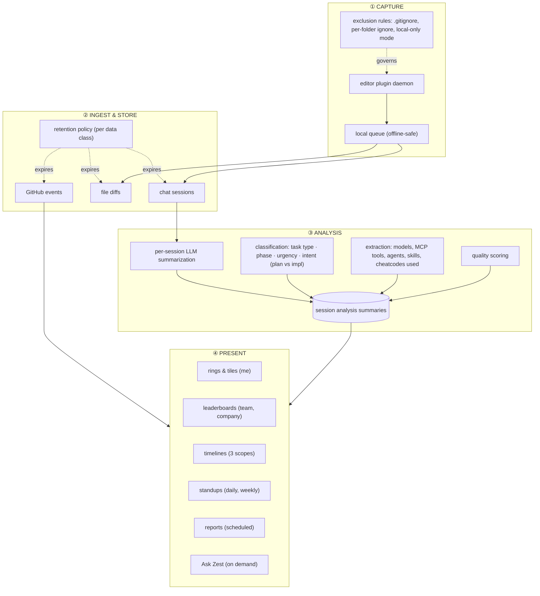
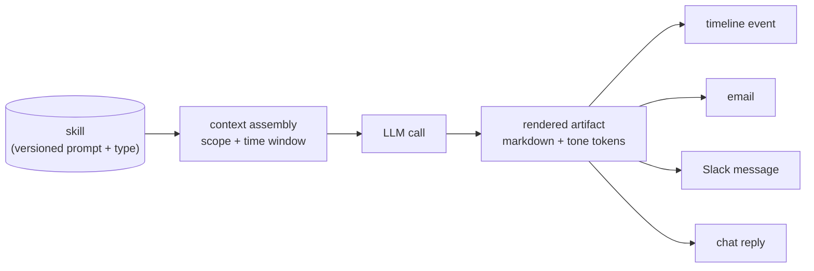
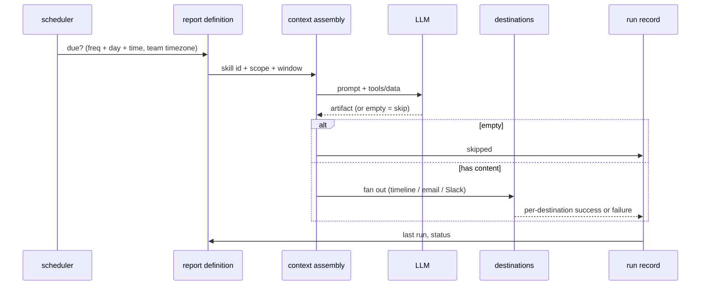

# Zest — How It Works

Stack-agnostic. This describes the *shape* of the system — what moves, what derives what, and where
the leverage is. Concrete infrastructure observations are quarantined in the appendix.

---

## 1. The core idea

Zest is a **telemetry pipeline for AI-assisted coding work**, wrapped in an org hierarchy, with an
**editable prompt layer** on top.

```
editor plugin ──▶ raw sessions ──▶ LLM analysis ──▶ derived facts ──▶ surfaces
                                                    ▲
                                     GitHub events ─┘
```

The interesting part is not the pipeline — it's that the *last mile is prompts, not code*. Standups,
reports and the chat agent are all the same machinery pointed at different stored prompts. Adding a
new "feature" like *PR Hero of the Week* means writing a prompt, not shipping code.

## 2. Four planes



**① Capture** is deliberately dumb and durable: queue first, sync later, never lose data, never
block the developer. It is also where privacy is enforced closest to the source.

**② Ingest** stores two rawlogs (AI sessions, GitHub events) with independent retention clocks.

**③ Analysis** is where raw becomes useful. Every session gets one summary record. Everything the
product later claims — "planning techniques used", "AI stack", "quality score", "plan vs impl split"
— reads from that derived layer, never from raw transcripts. This is what makes the read surfaces
cheap and keeps raw data deletable.

**④ Presentation** is six views over the same derived facts, differing only in scope and time
window.

## 3. The Skill indirection (the key move)

A **Skill** is a stored, versioned, typed prompt. Its *type* determines which pipeline consumes it:

| Skill type | Consumed by | Trigger | Input assembled |
|---|---|---|---|
| AI Standup | personal standup | daily / manual | one developer's sessions for the day |
| AI Team Standup | team standup | weekly, team timezone | N individual standups |
| Cheatcodes | the coding session itself | developer applies it | — (it's an *input* to work, and later a *measured* fact) |
| Ask Zest | chat agent **and** scheduled reports | on demand / cron | agent-chosen via tools |

So one library powers four surfaces, and the same skill can be answered live in chat *or* mailed out
on Friday — a **report is just an Ask Zest skill plus a scope, a destination set and a schedule**.
That collapse is the single biggest structural idea in the product.



**The contract at each stage:**

- *Context assembly* — scope (user / team / company) and window (7d, 14d, 30d) are supplied by the
  caller, not by the prompt. The prompt states the window in prose; the pipeline enforces it.
- *LLM call* — for Ask Zest, the model has tools and does its own retrieval; for standups, the input
  is pre-assembled.
- *Rendered artifact* — markdown with a **fixed heading contract** where a downstream renderer
  parses it, plus tone tokens (`{{highlight:…}}`, `{{muted}}`) that the client turns into styling.
- *Delivery* — the artifact fans out to any subset of destinations.

**Versioning matters here**: editing a skill creates a new version and preserves the old one, so
historical artifacts remain explainable ("which prompt produced this?").

**Empty output is a signal, not a failure**: a skill may return nothing to mean "skip this period".

## 4. Scope & aggregation

Three tiers, and every read surface exists at each tier:

```
        me                  team                 company
        ────────────────────────────────────────────────
ranked  Zest Ring/tiles     Team Leaderboard     team metric cards + leaderboard
feed    My Timeline         Team Timeline        Company Timeline
```

Aggregation is **pre-computed per tier**, not derived client-side: there is a distinct server-side
function for each rollup (company team metrics; latest analysis per user per team; intent counts per
team member). The reason is that each tier answers a different question and needs a different
grouping key — computing them from one generic query would be slow and would leak per-person detail
upward where the product deliberately doesn't want it (see §7).

Time windows are a first-class, user-visible control (Last 30 days) and appear again inside every
skill prompt.

## 5. Scheduling & delivery



Design points worth copying:

- **A "next run" preview at creation time.** The modal shows *"Next run: Mon Aug 3, 9:00am GMT+2 ·
  then weekly"* — timezone conversion made visible before you commit.
- **Timezone lives on the team**, not on the report. The weekly team standup fires at 5pm Friday
  *in the team's timezone*.
- **Delivery is observable as a first-class thing**: run counts, delivery-success counts, a
  "Failed delivery / Needs attention" bucket, and a per-timeline **Message log**. Generation success
  and delivery success are tracked separately.
- **Every report has an owner** and an Active toggle plus a run-now action.

## 6. Timeline as an event bus

All three timelines are one component over one typed event stream. Producers:

| Producer | Event type |
|---|---|
| standup generation | `zest/standup` (carries the full summary text inline) |
| GitHub sync | GitHub events |
| Ask Zest | conversations |
| report delivery | "Timeline" is a selectable report destination |

Consumers filter by type (All / Standups / Ask Zest / GitHub), scope and window. Because standup
text is carried *inside* the event, the weekly team standup can rebuild a week by paginating the
timeline instead of querying a separate standup store — the timeline is the read model.

## 7. Permission & dignity model

Two membership edges (user↔workspace with Member/Owner, user↔team with Lead/member) and a guard
function per edge, called before reads. Slug-based URLs carry a random suffix so they're
unguessable but readable.

Layered on top is something rarer, and it is enforced **in prompts rather than in code** — a policy
about what the analytics are allowed to say about people:

- individual cycle time is never ranked ("a team signal, not a personal scoreboard")
- quiet members are never presented as failing
- struggles are described as friction, never attributed to a person
- gaps are framed as practices worth borrowing, not deficits
- attention items are phrased as next steps, not callouts
- bots and unmapped accounts are separated *before* any ranking; PRs are credited to authors only,
  never reviewers or mergers

If you clone this product, this is the part to clone deliberately: a team-productivity tool without
these rules becomes a surveillance tool by default.

## 8. Data governance

Three enforcement points, composing one way:

```
plugin exclusions  →  workspace policy  →  personal policy
(.gitignore, ignore,   (collect what?      (may only further
 local-only mode)       retain how long?)    restrict)
```

Data is classed (user messages / assistant messages / GitHub events) with independent retention.
Because everything the UI shows reads from the *derived* analysis layer, raw transcripts can expire
without emptying the product.

## 9. The cold-start problem

Zest needs two integrations before it shows anything: the **editor plugin** (session data) and
**GitHub** (PR data). Until then, every surface is empty. The app handles this with unusual care,
and it's worth copying wholesale:

- a persistent banner with explicit **1/2** progress
- every empty state names the *specific* missing prerequisite and links to the fix
  ("No data today yet, Install the plugin to get started"), not a generic "nothing here"
- metric cards degrade to a targeted CTA ("Connect your GitHub to track this metric")
- the 47 seeded skills and 7 seeded reports mean the library and registry are *never* empty —
  the product looks finished before the user has done anything
- illustrated mascot art carries the empty states so blankness reads as personality, not brokenness

## 10. Extension points

- **Skills** are user-authored, so the analytics surface grows without deploys.
- **Reports** are user-authored schedules over those skills.
- **Personal access tokens** expose the Zest API to MCP-compatible agents — the product is designed
  to be read *by* agents, not just about them.
- A workspace-agents registry implies Ask Zest is one agent among a possible several.
- Server-driven feature flags gate rollout.

---

## Appendix — observed infrastructure

Factual observations from the running app, kept separate from the stack-agnostic body above. No
recommendation is implied.

| Layer | Observed |
|---|---|
| Web app | Next.js App Router (`/_next/static/chunks/*`, `main-app-*.js`), server-rendered pages |
| Data API | `api.meetzest.com/rest/v1/{table}` and `/rest/v1/rpc/{fn}` — a PostgREST-shaped surface over Postgres; a `*.supabase.co` host also appears in the page's resource list |
| Payments | Stripe (`js.stripe.com`), customer portal for plan/invoices/payment method |
| Product analytics | PostHog (session recorder, surveys, exception autocapture) |
| Web analytics | Google Analytics / GTM |
| Capture client | open-source Claude Code plugin, `github.com/Winding-Labs/zest-claude`: background daemon with auto-restart, local queue at `~/.claude-zest/queue/`, logs at `~/.claude-zest/logs/`, 60s sync interval, commands `/zest:login|logout|status|sync|enable|disable|workspace|ignore|unignore`, status line integration |
| Editors supported | Claude Code, Cursor, VS Code, Codex, Hermes (Claude Cowork deprecated) |
| Pricing seen | L3 "Agentic Engineering", $20/user/month, 14-day free trial, 750 credits/month |

Skill data was read from the live app on 2 Aug 2026; nothing was written, and no form was submitted.
