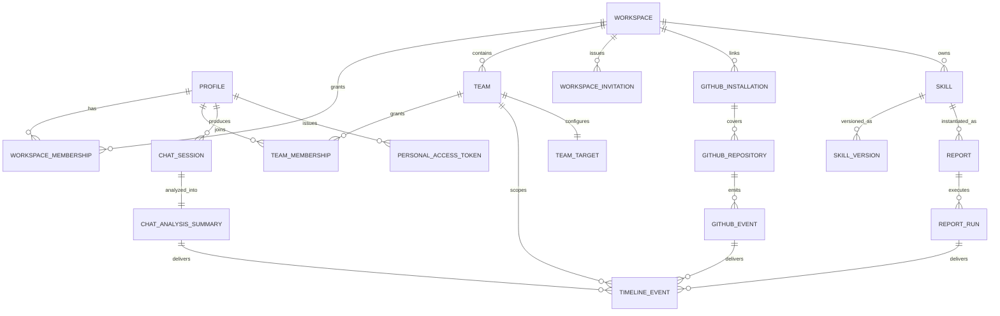

# Zest — Data Model

Two sources of evidence:

1. **Observed** — REST paths the browser actually requested (`api.meetzest.com/rest/v1/…`, a
   PostgREST-shaped surface: `/rest/v1/{table}` for tables, `/rest/v1/rpc/{fn}` for functions).
2. **Named in prompts** — the Ask Zest skill prompts name agent tools and field names directly.

Everything else is marked `[inferred]`.

## Observed tables

| Table | What it holds |
|---|---|
| `profiles` | user identity: name, email, avatar, slug, About Me, meme preference, GitHub handle |
| `workspaces` | company: name, slug, description, avatar/banner, data-control policy |
| `workspace_memberships` | user ↔ workspace, with role **Member / Owner** |
| `workspace_invitations` | pending invites: email + role + invite link |
| `teams` | team: name, slug, description, avatar/banner, **timezone**, Slack channel |
| `chat_sessions` | one AI coding session synced from the editor plugin |
| `chat_analysis_summaries` | the LLM's analysis of a session — the derived layer everything reads |
| `github_installations` | GitHub App installation per workspace |
| `github_repositories` | repos covered by an installation |
| `github_events` | PR/issue events pulled from GitHub |
| `extension_versions` | published plugin versions per editor (drives "update available") |
| `feature_flags` | server-driven flags |

## Observed RPCs

Grouped by what they exist for — the split is itself the architecture.

**Authorization guards**
- `is_member_of_workspace`
- `is_member_of_team`
- `get_user_team_membership`

**Roster**
- `get_team_members`

**Aggregation (one per scope tier)**
- `get_company_team_metrics` — company page's per-team metric card row
- `get_latest_user_analysis_per_team` — leaderboard's "last standup / AI stack" columns
- `get_team_member_intent_counts` — the Plan / Impl split per member

**Agents & billing**
- `get_workspace_agents`
- `get_workspace_mtd_spend`
- `check_auto_refresh_eligibility`

## Agent tools (named inside skill prompts)

These are the read API the Ask Zest agent is given. They are *not* the same as the REST tables —
they are a curated, scope-aware tool surface.

| Tool | Args seen | Returns |
|---|---|---|
| `search_workspace_users` | `workspaceId`, `teamId`, `query` | roster; empty query = everyone |
| `get_timeline` | paginated | typed timeline entries; `zest/standup` entries carry full summary text |
| `get_github_pull_requests` | team scope | PRs with `authorUserId` |
| `get_practice_usage` | facet, e.g. `cheatcodes` | practice / skill / cheatcode usage counts |
| `get_activity_rollup` | — | aggregated session activity incl. plan-vs-implementation balance |

## Entities not backed by an observed table `[inferred]`

| Entity | Evidence |
|---|---|
| `skills` (or `prompts`) | Skills library is server-rendered, versioned (`v1`), typed into 4 categories, has an author, a created date, an enabled toggle and a "default prompt" star |
| `skill_versions` | *"Editing will create a new version and preserve the original. All previous versions remain accessible in history."* |
| `reports` | registry rows: name, slug, owner, scope, destinations[], trigger, active flag |
| `report_runs` | "Runs last 7d", "Delivery success ✗0 ➤0", "Last run", "Never run", "Failed delivery" |
| `timeline_events` | typed feed shared by 3 scopes, filters All/Standups/Ask Zest/GitHub, namespace `zest/standup` |
| `standups` | may just be a timeline event type — `get_timeline` returns standup summary text inline |
| `chat_conversations` / `chat_messages` | Ask Zest conversation list ("Start Asking!") |
| `team_targets` | Set Daily Team Targets: 7 named numeric goals per team |
| `personal_access_tokens` | Settings → Tokens, "for MCP-compatible agents" |
| `notification_preferences` | Settings → Notifications (delivery hour, Slack posting, opt-outs) |
| `subscriptions` / `credits` | L3 plan, trial countdown, Stripe, "0 / 750 used this month" |
| `slack_installations` | "Connect Slack" at workspace level; team picks a channel |

## Relationships

## Metric vocabulary

The same names recur across the Zest Ring, tiles, leaderboards, team cards and targets — a small
closed vocabulary is the reason those surfaces stay consistent.

| Metric | Where it appears | Target default |
|---|---|---|
| **AI Tasks** | Ring, personal tiles, leaderboard | 10 / day |
| **AI Time** | Ring, tiles, team card ("Median AI Time") | 5 (min threshold) |
| **Agents Ran** | Ring, tiles | 8 / day |
| **Cheatcodes** | tiles | — |
| **AI Practices** | Daily Team Targets | 5 / day |
| **10x Time** | Daily Team Targets — "hours of peak productivity with AI coding agents" | 4 h |
| **PRs Open** | tiles, targets | 2 / day |
| **PRs Merged** | tiles, targets, leaderboard (`/wk`), team card (last 30 days) | 2 |
| **AI Adoption** | team card, leaderboard, teams overview | — |
| **Plan vs Impl** | team card, leaderboard (Plan / Impl columns) | — |
| **AI Stack / AI Toolkit** | leaderboard, team card ("No platforms") | — |
| **Last Standup** | leaderboard, teams overview | — |

## Data-control model

Two-level, and the levels compose one way only:

- **Workspace** (Settings → Data Controls): what may be collected (User messages, Assistant
  messages) and retention for User messages / Assistant messages / GitHub events (default 90 days).
- **User** (`/me/settings/data`): the same switches, defaulting to "Workspace default", with the
  stated rule — *"Settings here can only restrict what your workspace allows — never expand it."*

Plus plugin-side controls: `/zest:disable` (local-only), `/zest:ignore` per folder, and `.gitignore`
respect.
