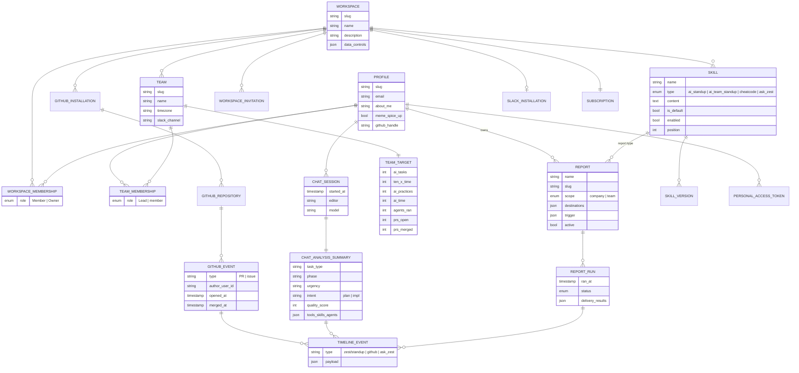

# Data model (ER)

Solid = observed table. Dashed note = `[inferred]`. See [../data-model.md](../data-model.md) for
evidence per entity.

Attribute lists on `CHAT_ANALYSIS_SUMMARY`, `SKILL`, `REPORT`, `TIMELINE_EVENT` and `TEAM_TARGET`
are `[inferred]` from UI columns, RPC names and skill prompt text — they are a reasonable starting
schema, not a transcription.
