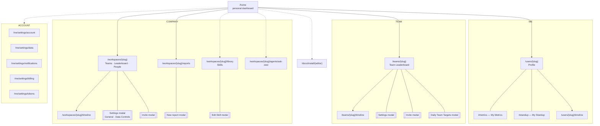

# Navigation / information architecture

Three scope tiers, each with the same two primitives.

## The symmetry

|  | ranked view | activity feed |
|---|---|---|
| **me** | Zest Ring + metric tiles | My Timeline |
| **team** | Team Leaderboard | Team Timeline |
| **company** | team metric cards + leaderboard | Company Timeline |

Company adds the three cross-cutting surfaces that have no per-scope equivalent: **Reports**,
**Skills**, **Ask Zest**. Those are workspace-level because the skill library and report registry
are shared assets.

## Persistent chrome

- Ask Zest composer + 23-playbook chip rail: bottom of **every** page.
- Breadcrumbs: top of every content page.
- Sidebar: collapsible, with workspace/team switcher at top and Install Plugin / Skills / user menu
  pinned to the bottom.
