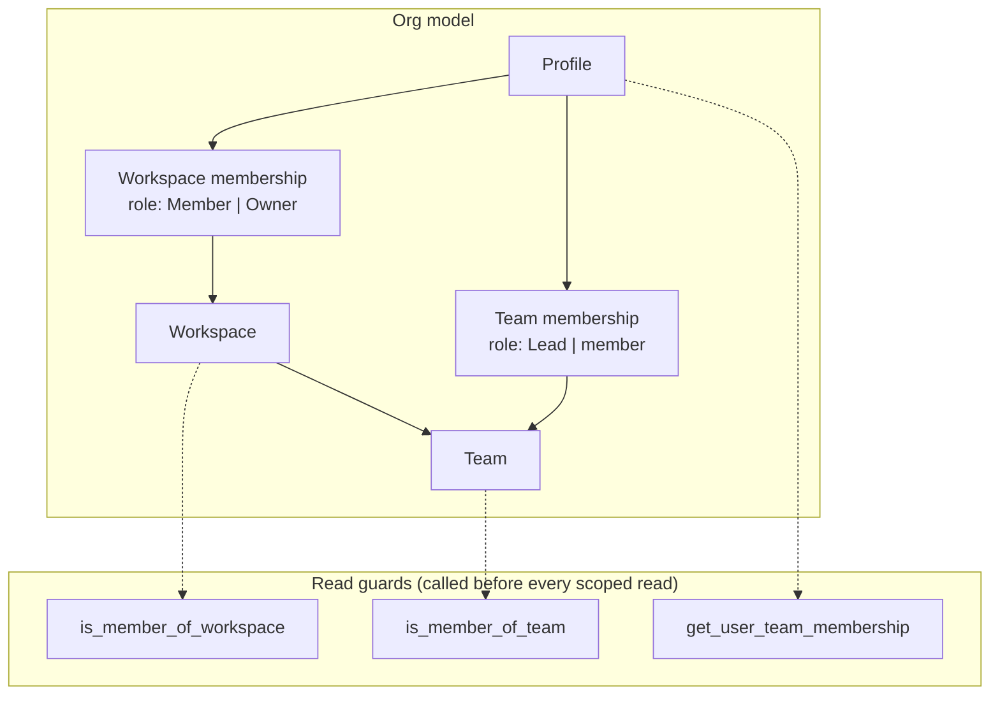
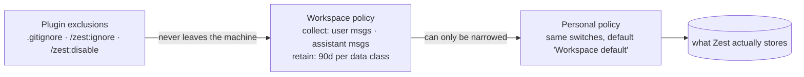
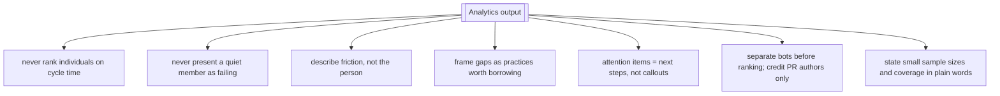

# Permissions, scope and data governance

## Data governance composes downward only

Stated rule in the app: *"Your data controls apply across all workspaces. Settings here can only
restrict what your workspace allows — never expand it."*

## The dignity policy

Enforced in prompt text rather than in code — see [../skills.md](../skills.md) §4. It is effectively
a fourth permission layer: not *who may read this*, but *what the system is allowed to say about a
person*.

