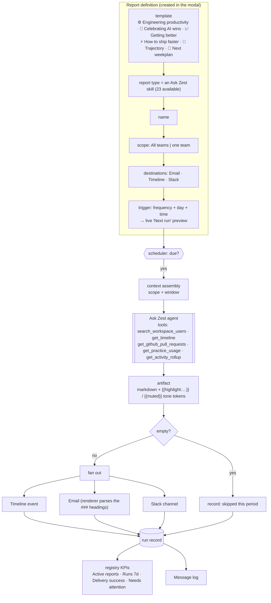

# Report pipeline

A report = an Ask Zest skill + a scope + destinations + a schedule.

## Notes

- The **template row** is a shortcut that preselects a report type — a curation layer over the 23
  skills, not a separate concept.
- **Generation success and delivery success are separate.** A report can generate fine and still
  land in the "Failed delivery" bucket.
- **Empty output means skip**, and is recorded as such rather than as an error.
- Seeded defaults ship with the workspace: 2 team-scoped (Fri 5pm UTC) and 5 company-scoped
  (Mon 7am UTC) — so the registry is populated on day one.
