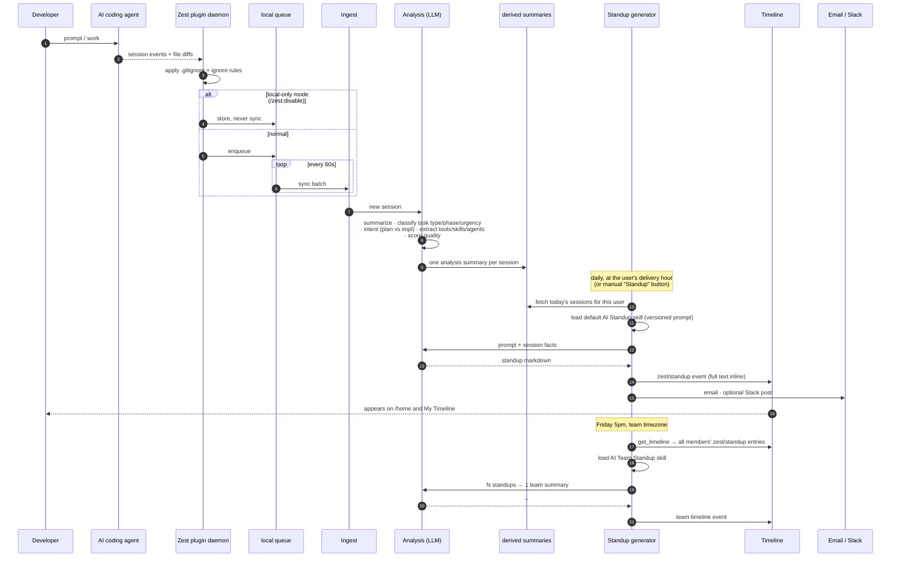

# Session capture → analysis → standup

From a keystroke in the editor to a standup on the timeline.

## Why it's shaped this way

- **Queue before sync**, so developer flow is never blocked and connectivity never loses data.
- **Exclusion at the source**, so excluded code never leaves the machine — not filtered server-side.
- **One analysis record per session** is the contract every downstream surface depends on. Raw
  transcripts can expire on their retention clock without breaking the product.
- **The generator is dumb; the skill is smart.** Changing what a standup says means editing a
  prompt, and the old version is preserved so past standups stay explainable.
- **The team standup reads the timeline**, not a standup table — the timeline is the read model.
