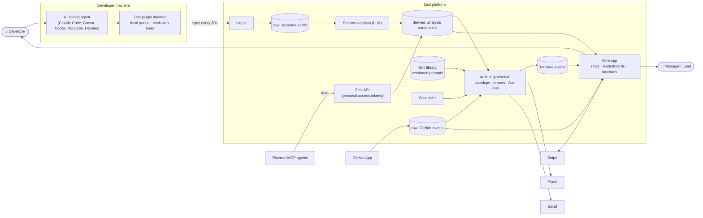

# System context

Who talks to what, and which way the data flows.

## Reading it

- The plugin is the only writer of session data; everything else in the platform is derived.
- **Two raw sources** (sessions, GitHub) converge at generation time — that's why almost every Ask
  Zest prompt cross-references PRs against sessions.
- The Skill library is an *input* to generation, sitting beside the data, editable by users.
- Timeline is both an output (artifacts land there) and an input (the weekly team standup reads it
  back via `get_timeline`).
